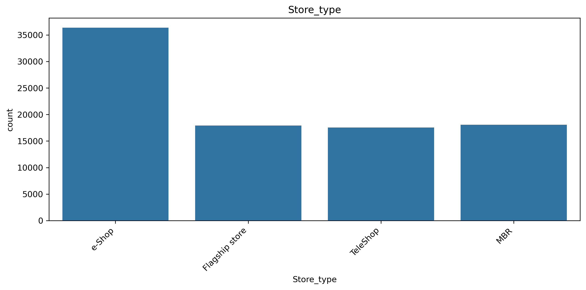
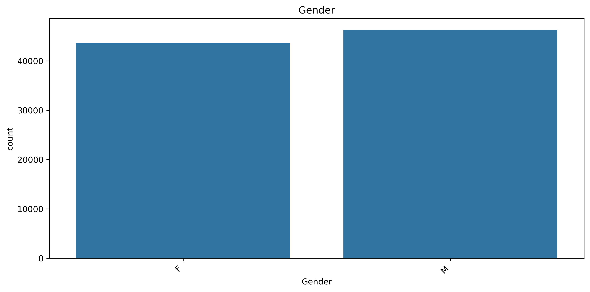
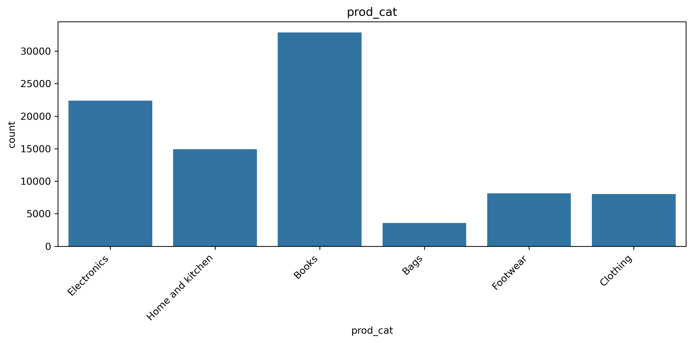
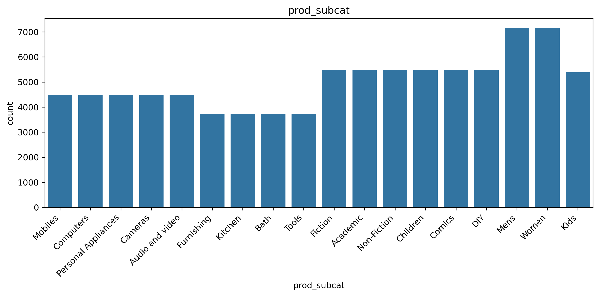

# Customer Analysis for Retail

## Project Overview

This project analyzes retail customer purchasing behavior using customer, transaction, and product datasets. The objective is to identify purchasing patterns, customer trends, and business opportunities through data cleaning, exploratory data analysis (EDA), and data visualization.

## Business Problem

Retail businesses generate large amounts of customer and transaction data. Understanding customer behavior helps organizations improve customer retention, optimize product offerings, and make data-driven business decisions.

This project answers key business questions such as:

* Which product categories are most popular?
* What are the purchasing patterns of customers?
* How are customers distributed across store channels?
* Are there meaningful trends across customer segments?

## Dataset Information

The project uses three datasets:

| Dataset           | Description                                   |
| ----------------- | --------------------------------------------- |
| Customer.csv      | Customer demographic information              |
| Transactions.csv  | Transaction-level retail purchase records     |
| prod_cat_info.csv | Product category and sub-category information |

## Tools & Technologies

* Python
* Pandas
* NumPy
* Matplotlib
* Seaborn
* Jupyter Notebook

## Project Workflow

### Data Preparation

* Merged customer, transaction, and product datasets.
* Performed data cleaning and preprocessing.
* Handled missing values and standardized formats.

### Exploratory Data Analysis (EDA)

* Analyzed customer demographics.
* Examined purchasing behavior.
* Evaluated product category and sub-category performance.
* Explored customer distribution across store channels.

### Data Visualization

Created visualizations to understand:

* Store Type Distribution
* Gender Distribution
* Product Category Analysis
* Product Subcategory Analysis

## Key Skills Demonstrated

* Data Cleaning
* Data Wrangling
* Exploratory Data Analysis (EDA)
* Trend Analysis
* Data Visualization
* Business Insight Generation
* Python for Data Analytics

## Sample Visualizations

### Store Type Distribution

### Gender Distribution

### Product Category Analysis

### Product Subcategory Analysis

## Repository Structure

Customer-Analysis-for-Retail/

├── README.md

├── Retail Case Study.ipynb

├── Retail Case Study.pdf

├── Customer.csv

├── Transactions.csv

├── prod_cat_info.csv

└── images/

    ├── Store_type_countplot.png

    ├── Gender_countplot.png

    ├── prod_cat_countplot.png

    └── prod_subcat_countplot.png

## Files Included

* Retail Case Study.ipynb
* Retail Case Study.pdf
* Customer.csv
* Transactions.csv
* prod_cat_info.csv

## Author

**Arup Ranjan Khawas**

Data Analyst | BI Analyst

LinkedIn: linkedin.com/in/arup-ranjan-analytics

Portfolio: arup-ranjan-analytics.lovable.app
